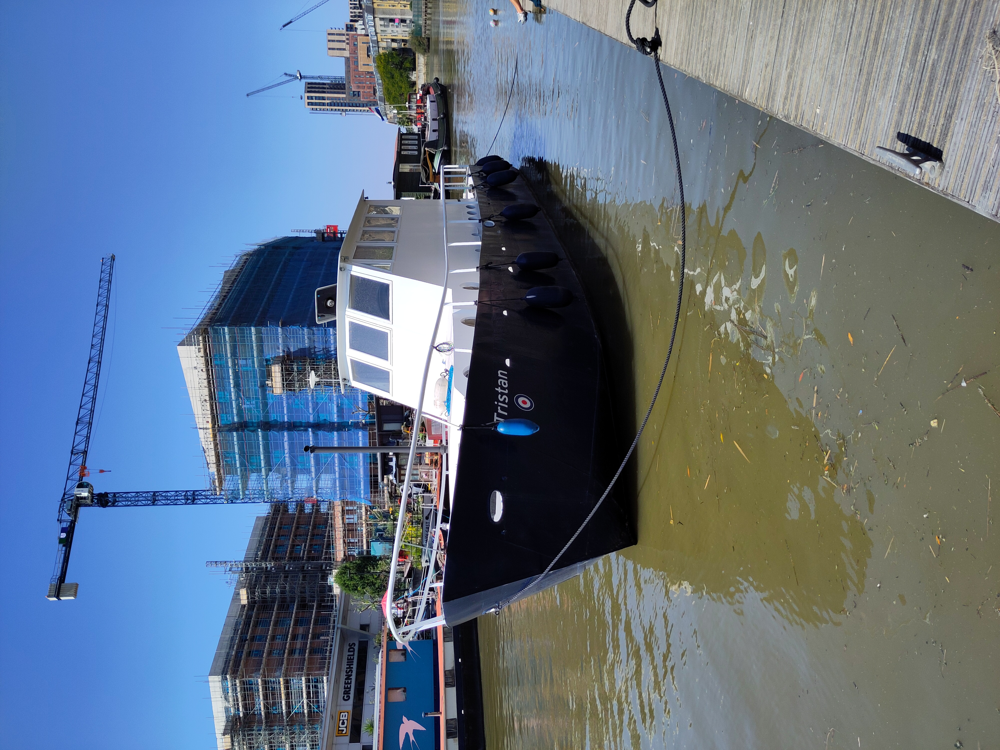

# tristan

This page is to share our boat TRISTAN's rich history. She was built in the UK in 1949 as a refueller for the Sunderland seaplanes of the Royal Air Force. She is now moored on the River Roding in Barking in East London after conversion to a house boat. She is listed at the <a href="https://www.nationalhistoricships.org.uk/register/2375/tristan" target="_blank">National Historic ship register</a>.

<figure>

<figcaption> Leaving the Roding for dry dock in Eel Pie Island (August 2026)  </figcaption>
</figure>

 
 
 
 
Andrea, a marine biologist at the Natural History Museum in London, and Arnaud, an oceanographer at Imperial College, are her proud owners.

